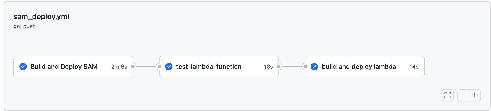

# Cloud Resume Challenge - Backend


This project is the implementation of the backend of [cloud resume challenge](https://cloudresumechallenge.dev/docs/the-challenge/aws/)    It implements SAM template which define the Infrastructure . 

## Technologies

- AWS API GATEWAY
- AWS LAMBDA FONCTION
- AWS DYNAMODB
- AWS SAM
- AWS CLOUDFORMATION
- PYTHON : boto3, pytest
- GITACTION

## Setup

- Prerequisites
    1. Have an AWS account
    2. Have a GitHub account
    3. Clone this project  
    4. Install AWS Command Line Interface (CLI) and AWS SAM CLI locally
    5. Create an Amazon S3 bucket in your AWS account to store the build package for development
    6. Create an AWS user with access keys, and secret key that you will use for secret key in Git Action
- Build  your application
    
    ```bash
    sam build
    ```
    
- Local testing
    
    If you want to test the application locally 
    
    1. Test the API Gateway  locally
        
        ```bash
        sam local start-api
        ```
        
    2. AWS SAM launches a Docker container with a mock API Gateway endpoint listening on `localhost:3000`
    3. You can use Insomnia or Postman to test the endpoint
    
- GitAction pipelines
    
    In the directory `.github/workflows/sam-deploy` you will see Github CI/CD pipeline. The files are configured using a YAML file. This file configures what specific action triggers a workflows. In your case it is *push* on *main*
    
    [https://gist.github.com/mvincentbb/7ccdefa01f602a3298613db615486c59](https://gist.github.com/mvincentbb/7ccdefa01f602a3298613db615486c59)
    
    1. Replace `##stack-name` with a name of the stack that you want to create. This stack will appear in your Cloudformation console
    2. Replace `##s3-bucket##` with the name of the S3 bucket previously created to store the deployment package.
    3. Replace both `##region##` with your AWS Region.
- Configuring AWS credentials in GitHub
    
    The GitHub Actions CI/CD pipeline requires AWS credentials to access your AWS account. The credentials must include [AWS Identity and Access Management](https://aws.amazon.com/iam/) (IAM) policies that provide access to Lambda, API Gateway, AWS CloudFormation, S3, and IAM resources.
    
    These credentials are stored as GitHub secrets within your GitHub repository, under **Settings**>**Secrets** . For more information, see “[GitHub Actions secrets](https://help.github.com/en/actions/automating-your-workflow-with-github-actions/creating-and-using-encrypted-secrets)”.
    
    In your GitHub repository, create two secrets named `AWS_ACCESS_KEY_ID`  and `AWS_SECRET_ACCESS_KEY` and enter the key values.
    
- Deploy your application
    
    ```bash
    git add .
    git commit -am "Configure pipeline for deployement"
    git push
    ```
    
    ## 
    
    
    


- Cleanup

To remove the  resources that you created in AWS, navigate to the CloudFormation console and delete the stack.

 You can  also use an AWS CLI command to remove the stack:

```bash
aws cloudformation delete-stack --stack-name ##stack-name
```

Replace `##stack-name` by the name of your stack

## Conclusion

At the end of this project you will learn about serverless application, how to use AWS ressource to build your application especially [AWS Serverless Application Model](https://aws.amazon.com/serverless/sam/) . You will also learn about unitest and GitAction  workflows.
